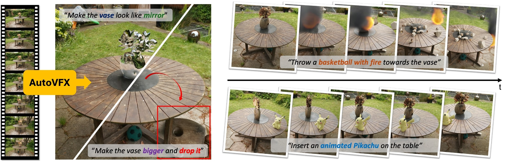

# AutoVFX

AutoVFX: Physically Realistic Video Editing from Natural Language Instructions.

### [Project Page](https://haoyuhsu.github.io/autovfx-website/) | [Paper](https://arxiv.org/abs/2411.02394)

[Hao-Yu Hsu<sup>1</sup>](https://haoyuhsu.github.io/), [Zhi-Hao Lin<sup>1</sup>](https://zhihao-lin.github.io/), [Albert J. Zhai<sup>1</sup>](https://ajzhai.github.io/), [Hongchi Xia<sup>1</sup>](https://xiahongchi.github.io/), [Shenlong Wang<sup>1</sup>](https://shenlong.web.illinois.edu/)

<sup>1</sup>University of Illinois at Urbana-Champaign



## :dart: Progress
- [x] Environment Setup
- [x] Pretrained checkpoints, data, and software preparation
- [x] Simulation example on Garden scene
- [ ] Details of pose extraction (SfM) and pose alignment
- [ ] Code for sampling custom camera trajectory
- [ ] Details of estimating relative scene scale
- [ ] Details of training 3DGS
- [ ] Details of surface reconstruction
- [ ] Details of light estimation
- [ ] Details of running simulations on waymo road scenes

## :clapper: Prerequisites
The code has been tested on:
- **OS**: Ubuntu 22.04.5 LTS
- **GPU**: NVIDIA GeForce RTX 4090
- **Driver Version**: 550
- **CUDA Version**: 12.4
- **nvcc**: 11.8

## :clapper: Environment Setup

- Create environment:
```bash
git clone https://github.com/haoyuhsu/autovfx.git
cd autovfx/
conda create -n autovfx python=3.10
conda activate autovfx
```

- Install PyTorch & cudatoolkit:
```bash
conda install pytorch==2.0.1 torchvision==0.15.2 torchaudio==2.0.2 pytorch-cuda=11.8 -c pytorch -c nvidia

# To build the necessary CUDA extensions, cuda-toolkit is also required. (Optional)
conda install -c "nvidia/label/cuda-11.8.0" cuda-toolkit
```

- Install Gaussian Splatting submodules:
```bash
cd sugar/gaussian_splatting/
pip install submodules/diff-gaussian-rasterization
pip install submodules/simple-knn
```

- Install segmentation & tracking modules:
```bash
# Tracking-with-DEVA
cd ../../tracking
pip install -e .

# Grounded-SAM
git clone https://github.com/hkchengrex/Grounded-Segment-Anything.git
cd Grounded-Segment-Anything
export AM_I_DOCKER=False
export BUILD_WITH_CUDA=True
python -m pip install -e segment_anything
python -m pip install -e GroundingDINO

# RAM & Tag2Text
git submodule init
git submodule update

git clone https://github.com/xinyu1205/recognize-anything.git
pip install -r ./recognize-anything/requirements.txt
pip install -e ./recognize-anything/
```

- Install inpainting modules:
```bash
# LaMa
cd ../../inpaint/lama
pip install -r requirements.txt
```

- Install lighting estimation modules:
```bash
# DiffusionLight
cd ../../lighting/diffusionlight
pip install -r requirements.txt
```

- Install other required packages:
```bash
# Other packages
pip install openai objaverse kornia wandb open3d plyfile imageio-ffmpeg einops e3nn pygltflib lpips scann open_clip_torch sentence-transformers==2.7.0

# PyTorch3D (try one of the commands)
pip install "git+https://github.com/facebookresearch/pytorch3d.git"
pip install "git+https://github.com/facebookresearch/pytorch3d.git@stable"
conda install pytorch3d -c pytorch3d

# Trimesh
pip install trimesh==4.3.2
pip install Rtree==1.2.0
conda install -c conda-forge embree=2.17.7
conda install -c conda-forge pyembree

cd ../..
```


## :clapper: Dataset Preparation

Please download the preprocessed dataset of Garden scenes from [here](https://drive.google.com/drive/folders/1eRdSAqDloGXk04JK60v3io6GHWdomy2N?usp=sharing). Details on using your own dataset will be updated soon.


## :clapper: Download pretrained checkpoints, required data and Blender

### Tracking modules
```bash
cd tracking
bash download_models.sh
```

### Inpainting modules
```bash
cd inpaint && mkdir ckpts
wget https://huggingface.co/smartywu/big-lama/resolve/main/big-lama.zip && unzip big-lama.zip -d ckpts
rm big-lama.zip
```

### Asset retrieval data
We use CLIP & SBERT features to annotate assets in Objaverse, and we use SBERT features to annotate PBR materials in PolyHaven. The preprocessed embeddings of both Objaverse 3D assets and PolyHaven PBR materials need to be downloaded. 

```bash
cd retrieval
gdown --folder https://drive.google.com/drive/folders/1Lw87MstzbQgEX0iacTm9GpLYK2UE3gNm
gdown https://drive.google.com/uc?id=1adZo_FPyLj7pFofNJfxSbnAv_EaJEV75
unzip polyhaven.zip && rm polyhaven.zip
```

### Download Blender 
We tested with [Blender 3.6.11](https://www.blender.org/download/release/Blender3.6/blender-3.6.11-linux-x64.tar.xz). Note that Blender 3+ requires Ubuntu version >= 20.04.

```bash
cd third_parties/Blender
wget https://download.blender.org/release//Blender3.6/blender-3.6.11-linux-x64.tar.xz
tar -xvf blender-3.6.11-linux-x64.tar.xz
rm blender-3.6.11-linux-x64.tar.xz
```

## :clapper: Estimate Scene Properties
Details of estimating scene properties (e.g., geometry, appearance, lighting, and semantics) will be updated soon.


### (Appearance) Training 3DGS


### (Geometry) Estimating scene meshes (BakedSDF-mlp & StreetSurf)


### (Lighting) Estimating light source for indoor scenes


### (Semantics) Estimating relative scene scale


## :clapper: Start Simulation

### Example demos from Gardenverse
Please download the preprocessed Garden scene from [here](https://drive.google.com/drive/folders/1eRdSAqDloGXk04JK60v3io6GHWdomy2N?usp=sharing). Also, please download the pretrained 3DGS checkpoints and extracted object instances from [here](https://drive.google.com/drive/folders/1KE8LSA_r-3f2LVlTLJ5k4SHENvbwdAfN?usp=sharing). All the parameters are listed in the `opt.py`

<!-- ***Need to update with .zip file for gdown*** -->
```bash
mkdir datasets && cd datasets
gdown --folder https://drive.google.com/drive/folders/1eRdSAqDloGXk04JK60v3io6GHWdomy2N
cd ../
mkdir output && cd output
gdown --folder https://drive.google.com/drive/folders/1KE8LSA_r-3f2LVlTLJ5k4SHENvbwdAfN
```

- Text Prompts: *"Drop 5 basketballs on the table."*
```bash
export OPENAI_API_KEY=/your/openai_api_key/
export MESHY_API_KEY=/your/meshy_api_key/   # if you want to retrieve generated 3D assets

SCENE_NAME=garden_large
CUSTOM_TRAJ_NAME=transforms_001
SCENE_SCALE=2.67
BLENDER_CONFIG_NAME=blender_cfg_rigid_body_simulation

python edit_scene.py \
    --source_path datasets/${SCENE_NAME} \
    --model_path output/${SCENE_NAME}/ \
    --gaussians_ckpt_path output/${SCENE_NAME}/coarse/sugarcoarse_3Dgs15000_densityestim02_sdfnorm02/22000.pt \
    --custom_traj_name ${CUSTOM_TRAJ_NAME} \
    --anchor_frame_idx 0 \
    --scene_scale ${SCENE_SCALE} \
    --edit_text "Drop 5 basketballs on the table." \
    --scene_mesh_path datasets/${SCENE_NAME}/mesh/mesh.obj \
    --blender_config_name ${BLENDER_CONFIG_NAME}.json \
    --blender_output_dir_name ${BLENDER_CONFIG_NAME} \
    --render_type MULTI_VIEW \
    --deva_dino_threshold 0.45 \
    --is_uv_mesh
```

## :clapper: Citation
If you find this paper and repository useful for your research, please consider citing: 
```bibtex
@article{hsu2024autovfx,
    title={AutoVFX: Physically Realistic Video Editing from Natural Language Instructions},
    author={Hsu, Hao-Yu and Lin, Zhi-Hao and Zhai, Albert and Xia, Hongchi and Wang, Shenlong},
    journal={arXiv preprint arXiv:2411.02394},
    year={2024}
}
```

## :clapper: Acknowledgement
This project is supported by the Intel AI SRS gift, Meta research grant, the IBM IIDAI Grant and NSF Awards #2331878, #2340254, #2312102, #2414227, and #2404385. Hao-Yu Hsu is supported by Siebel Scholarship. We greatly appreciate the NCSA for providing computing resources. We thank Derek Hoiem, Sarita Adve, Benjamin Ummenhofer, Kai Yuan, Micheal Paulitsch, Katelyn Gao, Quentin Leboutet for helpful discussions.

Our codebase are built based on [gaussian-splatting](https://github.com/graphdeco-inria/gaussian-splatting), [SuGaR](https://github.com/Anttwo/SuGaR), [SDFStudio](https://github.com/autonomousvision/sdfstudio), [DiffusionLight](https://github.com/DiffusionLight/DiffusionLight), [Tracking-Anything-with-DEVA](https://github.com/hkchengrex/Tracking-Anything-with-DEVA), [Objaverse](https://github.com/allenai/objaverse-xl), and the most important [Blender](https://github.com/blender/blender). Thanks for open-sourcing!.
